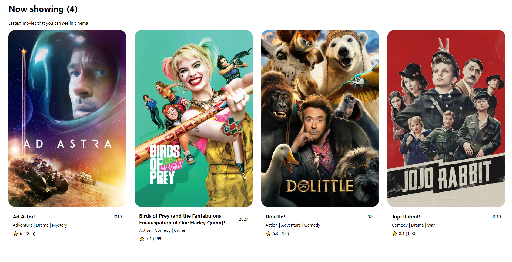

## Day 1
Today, I decided to fully translate my blog into English. Started by making some changes in bio, edited config file and pushed everything to Github.

Then decided to start working on my movie app. Created react app using npx create-react-app and fetched some data from MovieDB API. Learned how to use useEffect and useReducer and did some styling using styled-components. At the moment my movie-app look like that: 

### How to fetch data from a few APIs

Also today I learned how to fetch data from a few API. If you want to fetch data from different API or another data from your API (that your first fetched JSON object do not provide) then you can just use [Promise.all()](https://developer.mozilla.org/en-US/docs/Web/JavaScript/Reference/Global_Objects/Promise/all).

Simple example:

https://codepen.io/rafalmoneta/pen/bGddQgd