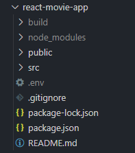
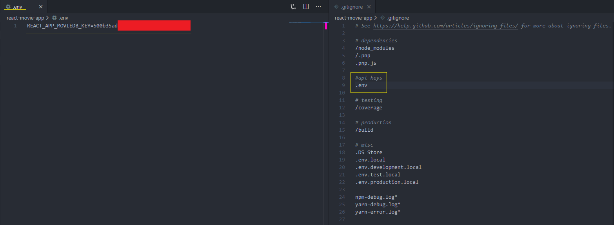

On day 2, I decided to publish some code on GitHub. To do that, I had to learn how to hide your API keys. There is a simple guide on how to do that.

## How to hide sensitive data in .env file
1. Create a file called .env in the root of your project’s directory.

2. Inside the .env file create name to your API key, for example **REACT_APP_MOVIEDB_KEY** and add .env file to .gitignore.

3. Access the API key via the process.env object.
```javascript
console.log(process.env.REACT_APP_MOVIEDB_KEY)
```
If after saving files and reloading the page this do not work, try to restart your server!