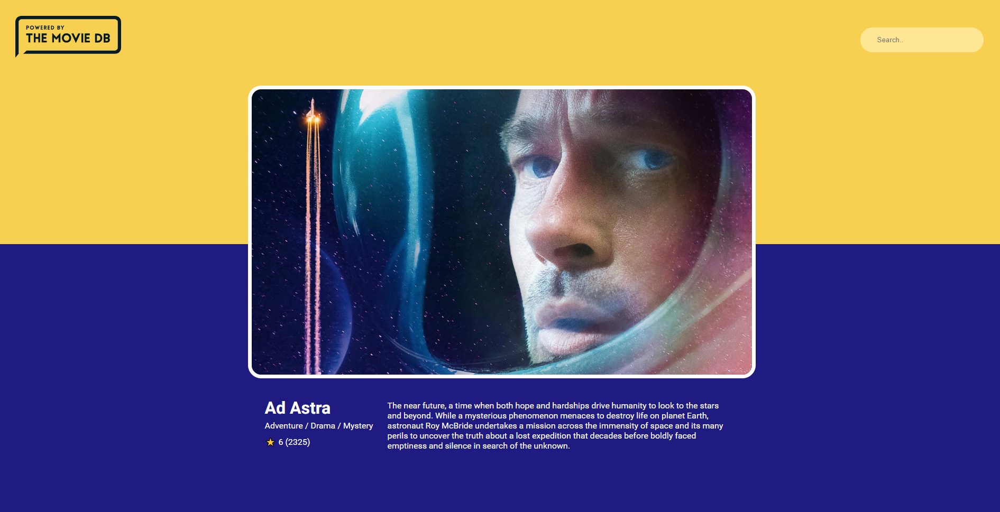

On days 3 and 4, I had the Financial Math and Basics of Law exams at my University. Besides that, I managed to find some time to work on my movie app.

On days 5 and 6, I decided to redesign my app. I learned a valuable lesson to always do a design sketch first, then start coding. After some troubles with useEffect hook, I finally finish the first version of my app.

You can see my code [there](https://github.com/rafalmoneta/movie-app-react) and test my movie-app [there](https://rafalmoneta.github.io/movie-app-react/).

In version two of my movie-app I want to add:
- [ ] Favorite movies button
- [ ] 'To watch' list
- [ ] More info on 'movie' page
- [ ] Create page about actors and producers etc