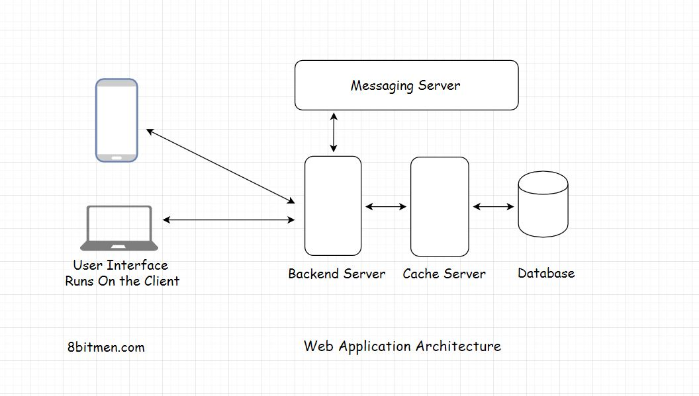

**Architektura aplikacji internetowej** składa się z kilku komponentów takich jak: baza danych, kolejka komunikatów (*message queue*), pamięć podręczna (*cache*), interfejs użytkownika oraz z serwera.

Na powyższym obrazku widzimy typową architekturę aplikacji używaną w większości aplikacji internetowych. Jeżeli posiadamy wiedzę na temat poszczególnych komponentów możemy z łatwością oprzeć się na tego typu architekturze dla bardziej złożonych wymagań i aplikacji.

Przejdźmy do omówienia jednej z ważniejszych zagadnień w architekturze aplikacji webowych.

## Architektura Client-Server

**Architektura Client-Server** to model architektury w którym serwer hostuje, dostarcza i zarządza większością zasobów i usług, które zapewnia klientowi.

Inaczej mówiąc - klient wysyła zapytanie *(request)* do serwera, po konkretną informację lub usługę, a serwer odpowiada *(respond)* klientowi z konkretną informacją lub usługą.

Prawie każda z znanych stron: Facebook, Twitter czy aplikacja wybranego banku opiera się na architekturze client-server. Omówmy krótko z każdy z komponentów.

### Client

**Klient** (c*lient) -* posiada interfejs użytkownika, który prezentuje naszą aplikacje (inaczej mówiąc odpowiada za wygląd naszej aplikacji). Klientem może być aplikacja mobilna, przeglądarka internetowa czy na przykład iPad.

Wyróżniamy dwa rodzaje klienta:

* **thin client** - to klient, który posiada tylko interfejs użytkownika, nie trzyma w sobie żadnej logiki i dla każdego działania wysyła zapytanie (request) do serwera.
* **fat client** - to klient, który posiada interfejs użytkownika, ale także część lub całość logiki np gra online

### Server

Głównym zadaniem **serwera** jest otrzymywanie zapytań od klienta oraz udzielenie odpowiedzi na podstawie parametrów żądania otrzymanych od klienta. Jeżeli klient wysłał zapytanie o date dnia dzisiejszego, jego zadaniem jest przesłanie mu tej konkretnej daty.

Wszystkie komponenty aplikacji internetowej wymagają serwera do uruchomienia. Może to być baza danych, kolejka komunikatów, pamięć podręczna lub dowolny inny komponent. We współczesnym tworzeniu aplikacji nawet interfejs użytkownika jest hostowany osobno na dedykowanym serwerze.

### Server-Side Rendering

Często programiści aplikacji internetowych, do renderowania interfejsu użytkownika używają serwera, a po jego całkowitym wyrenderowaniu przesyłają wyrenderowany interfejs do klienta. Ta technika nazywana jest Server-Side Rendering.

### Komunikacja między Client & Server

Klient & serwer opiera się na modelu zapytań (request) i odpowiedz (respond). Klient wysyła zapytanie, a server odpowiada z konkretnymi danymi. Jeżeli nie ma zapytania, nie ma odpowiedzi. Cała komunikacja odbywa się dzięki protokołowi HTTP.

### Protokół HTTP.

Protokół HTTP - stanowi podstawę każdej wymiany danych w Internecie i jest protokołem klient-serwer, co oznacza, że żądania są inicjowane przez odbiorcę, przeważnie przeglądarkę internetową (klienta). Więcej możesz przeczytać na [MDN]([https://developer.mozilla.org/pl/docs/Web/HTTP/HTTP_wiadomosci_ogólne](https://developer.mozilla.org/pl/docs/Web/HTTP/HTTP_wiadomosci_og%C3%B3lne)).